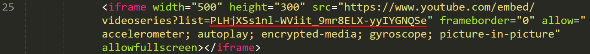

# Painel - NovoSGA

Alteração do tema default do PAINEL, que atua junto ao <a href="http://novosga.org/">NovoSGA</a> para inserção de uma playlist de videos do youtube, alteração de cores e inserção do logotipo da instituição

<h2>Para inserir o tema em seu painel</h2>
 × Clone ou faça o download (https://github.com/1bertovalente/TemaSGAPlaylistYoutube) para obter o tema 
 × Descompacte e mova até o diretório do seu painel/themes (No meu caso está em: /var/www/html/painel/themes) 
 × Acesse o painel pelo navegador de sua escolha e coloque o nome do tema (No meu caso: PainelSGAPlaylistYoutube "Pode ser alterado conforme sua escolha").
 
 
 <h2>Para alterar o logotipo:</h2>
 × Abra o arquivo index.html (No meu caso está localizado em: /var/www/html/painel/themes), na terceira linha informe o novo caminho da imagem que pode está localizado na internet ou localmente
  
  
  <h2>Para alterar a playlist:</h2>
 × Abra o arquivo index.html (No meu caso está localizado em: /var/www/html/painel/themes), na vigésima quinta linha informe o novo ID da da playlist que pode está sendo localizada no youtube
  
 
 
 
 
 
 

